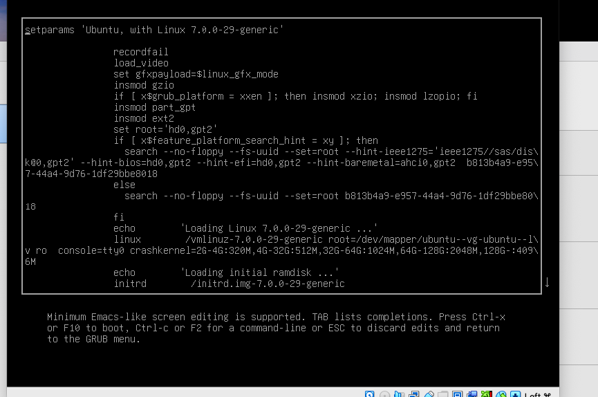

# Linux grub -recovery

```
// Linux qqator oxirida 4096M dan keyin (space) tashlab  "init=/bin/bash" qo'shish kerak
```

<figure><figcaption></figcaption></figure>

```
// Keyin: Ctrl + X
```

```
// 1. Avval filesystem'ni write mode qiling
mount -o remount,rw /
2. Sudoers faylini oching

visudo ishlatamiz:

visudo

Ichidan mana shu qatorni toping:

%sudo ALL=(ALL:ALL) ALL

Agar sizda hozir:

sudo ALL=(ALL:ALL) ALL

bo‘lsa, boshiga % qo‘ying:

%sudo ALL=(ALL:ALL) ALL

% ni olib tashlamang.

Saqlash:

Ctrl + O
Enter
Ctrl + X
3. Syntax tekshiring
visudo -c

Agar:

/etc/sudoers: parsed OK

chiqsa — hammasi yaxshi.

4. User sudo group'da ekanini tekshiring

Sizning username'ingizni bilmasak:

ls /home

Masalan asror chiqsa:

id asror

Agar sudo group ko‘rinsa, yaxshi.

Agar ko‘rinmasa:

usermod -aG sudo asror

(asror o‘rniga o‘z username'ingizni yozing.)

5. Oddiy bootga qayting
sync
exec /sbin/reboot -f

VM qayta ishga tushadi.

Keyin oddiy user bilan login qilib:

sudo su -

ni tekshiring.
```
